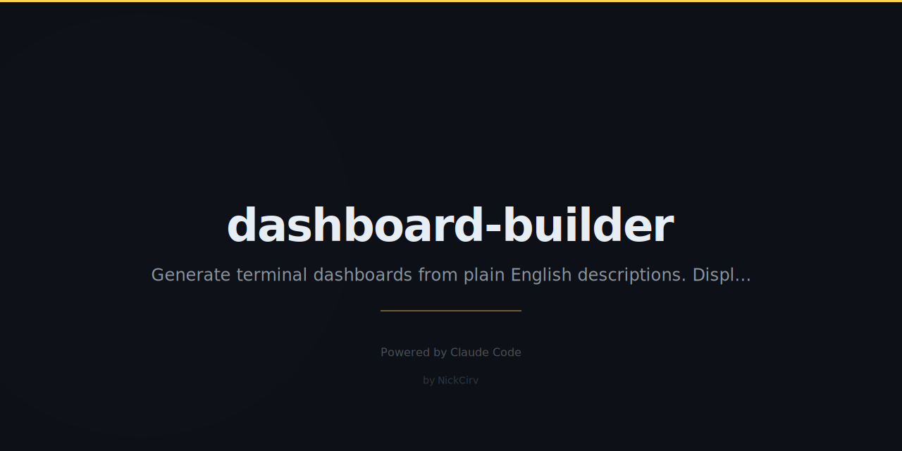

# dashboard-builder

Describe a terminal dashboard in plain English. Get it running instantly.

No config files. No setup. Zero dependencies.

```
npx dashboard-builder "show me CPU, memory, and recent git commits"
```

---

## Preview

```
┌──────────────────────────────────────────────────────────────────────┐
│  Dev Dashboard                                        Refreshing in 2s│
├──────────────────────────────┬───────────────────────────────────────┤
│  CPU Load                    │  Recent Commits                       │
│  ████░░░░░░░░░░░░░░ 18%      │  • a3f9c12 feat: add auth (2h ago)   │
│  1m:  0.45                   │  • b7e2109 fix: redirect (5h ago)     │
│  5m:  0.52                   │  • 9d1cc43 chore: bump deps (1d ago)  │
│  15m: 0.48                   │  • f445abc docs: update README        │
│  8 CPUs                      │                                       │
├──────────────────────────────┼───────────────────────────────────────┤
│  Git Status                  │  npm Scripts                         │
│  ● main                      │  • dev: vite                         │
│  Changed:   3                │  • build: tsc && vite build          │
│  Staged:    1                │  • test: vitest                      │
│  Untracked: 2                │  • lint: eslint src/                 │
│  Stashes:   0                │                                       │
└──────────────────────────────┴───────────────────────────────────────┘
```

```
┌──────────────────────────────────────────────────────────────────────┐
│  System Monitor                                       Refreshing in 1s│
├──────────────────┬──────────────────┬─────────────────────────────── ┤
│  CPU Load        │  Memory          │  Disk Usage                    │
│  ████░░ 23%      │  ██████░░ 58%    │  ████████░░░ 74%               │
│  1m:  0.45       │  Used:  9.4GB    │  Used:   186G                  │
│  5m:  0.52       │  Free:  6.6GB    │  Free:   64G                   │
│  15m: 0.48       │  Total: 16.0GB   │  Total:  250G                  │
├──────────────────┴──────────────────┴───────────────────────────────┤
│  Uptime                                                               │
│  12d 4h 37m                                                           │
│  system uptime                                                        │
└──────────────────────────────────────────────────────────────────────┘
```

```
┌──────────────────────────────────────────────────────────────────────┐
│  Focus Mode                                           Refreshing in 1s│
├──────────────────────────────┬───────────────────────────────────────┤
│  Pomodoro Timer              │  Today's Commits                      │
│                              │  • 9d1cc43 fix: null check (4m ago)  │
│  19:34                       │  • f445abc feat: dark mode (1h ago)  │
│  WORK                        │  • a3f9c12 chore: format (3h ago)    │
│  ████████████░░░░ 74%        │                                       │
├──────────────────────────────┴───────────────────────────────────────┤
│  TODO Count                                                           │
│  14 TODOs                                                             │
│  across 6 files                                                       │
└──────────────────────────────────────────────────────────────────────┘
```

---

## Installation

```bash
# Run instantly via npx (no install needed)
npx dashboard-builder --system

# Or install globally
npm install -g dashboard-builder
dashboard-builder --dev
```

---

## Usage

### Preset dashboards (no API key needed)

```bash
npx dashboard-builder --git        # git log, status, changed files
npx dashboard-builder --system     # CPU, memory, disk, uptime
npx dashboard-builder --dev        # CPU + git + npm scripts
npx dashboard-builder --focus      # Pomodoro timer + commits + TODOs
npx dashboard-builder --project    # Auto-detect project type + stats
npx dashboard-builder --list       # Show all available presets
```

### AI mode (with ANTHROPIC_API_KEY)

```bash
export ANTHROPIC_API_KEY=sk-ant-...

npx dashboard-builder "show CPU, memory, git log, and count TODOs"
npx dashboard-builder "pomodoro timer with recent commits and git status"
npx dashboard-builder "countdown to Friday with system uptime and disk usage"
```

AI uses `claude-haiku-4-5` to parse your description and generate a dashboard config — runs instantly.

### Save & load configs

```bash
# Generate and save
npx dashboard-builder --save myboard.json "CPU, memory, and git log"

# Load saved config
npx dashboard-builder --load myboard.json

# Preview a preset as JSON
npx dashboard-builder --preview system
```

---

## Panel types

| Type | Description |
|------|-------------|
| `metric` | Single stat with ASCII bar (CPU load, percentages) |
| `bar` | Progress bar with details (memory, disk) |
| `list` | Bullet list (git commits, npm scripts) |
| `count` | Big number display (TODO count) |
| `timer` | Countdown/countup with bar (Pomodoro) |
| `countdown` | Time until a target (Friday 5pm) |
| `uptime` | System uptime formatted |
| `git.status` | Branch, staged, changed, untracked |
| `project.info` | Project name, type, directory |

---

## Data sources

| Source | What it provides |
|--------|-----------------|
| `os.loadavg` | CPU load averages (1/5/15 min) |
| `os.memory` | RAM used / free / total |
| `os.uptime` | System uptime |
| `os.platform` | Hostname, OS, username |
| `git.log` | Last 8 commits with relative time |
| `git.status` | Branch, staged, changed, untracked, stash count |
| `git.diff.stat` | Changed file names |
| `npm.scripts` | Scripts from package.json |
| `todos.count` | Count of TODO/FIXME/HACK in source files |
| `disk.usage` | Disk used/free/total for current directory |
| `project.info` | Auto-detects Node/PHP/Python/Go/Rust |
| `countdown.friday` | Countdown to Friday 5pm |
| `pomodoro` | 25-minute focus timer (persists across restarts) |

---

## Controls

| Key | Action |
|-----|--------|
| `q` | Stop dashboard |
| `Ctrl-C` | Stop dashboard |

Terminal resize is handled automatically.

---

## Requirements

- Node.js 18+
- Zero external dependencies — only built-in modules
- Works on macOS, Linux, WSL

---

## Environment variables

| Variable | Description |
|----------|-------------|
| `ANTHROPIC_API_KEY` | Enables AI mode. Without it, presets work fine. |

---

## License

MIT
