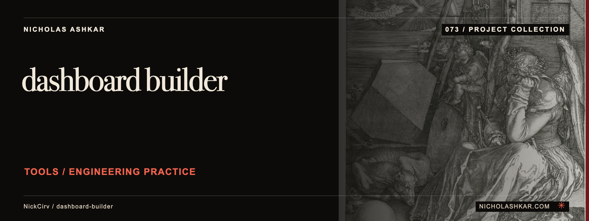

# dashboard-builder

Builds a terminal dashboard configuration from a prompt and renders supported local widgets.


<a id="usage"></a>

<a id="preset-dashboards-no-api-key-needed"></a>

<a id="ai-mode--generates-a-custom-layout-from-your-description"></a>

## What it does

- Prompt/config workflow.
- Local system and Git sources.
- Saved dashboard JSON.
- Timed refresh.


<a id="install"></a>

## Quickstart

Prerequisites: Node.js `>=20` and npm; Git is also used by the implementation. The checkout below pins the source used for this documentation.

```sh
git clone https://github.com/NickCirv/dashboard-builder.git
cd dashboard-builder
git checkout 3380553ec4c613c5f4877d478d32ccfc6657d657
node index.js --preview system
```

**Expected behavior (illustrative, not captured):** Prints the built-in system dashboard configuration as JSON without launching the terminal UI.

Examples are source-inspected, **not runtime-tested**. See the research record for verification gaps.

## Boundaries and data

Prompt-based configuration can call Anthropic with ANTHROPIC_API_KEY. Widget data and generated layouts need review; some widgets execute local shell commands. An interactive terminal is required.

## Development

The manifest defines `npm test` as:

```sh
node --test
```

The captured suite is a smoke check, not end-to-end behavior coverage. Examples include “entry is valid JavaScript”. Tests were not run for this documentation revision.

See [implementation and command reference](docs/REFERENCE.md) for the package scripts and inspected interfaces, and [research record](docs/RESEARCH.md) for the pinned source, document decisions and unresolved checks.

## License and contact

See [LICENSE](LICENSE) for the original terms and attribution. Legal text is unchanged.

[Nicholas Ashkar](https://nicholashkar.com/) · [Discuss a project](https://nicholashkar.com/#oxblood-contact)
